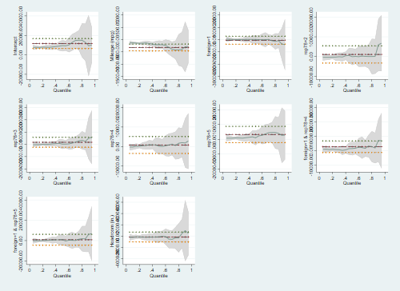
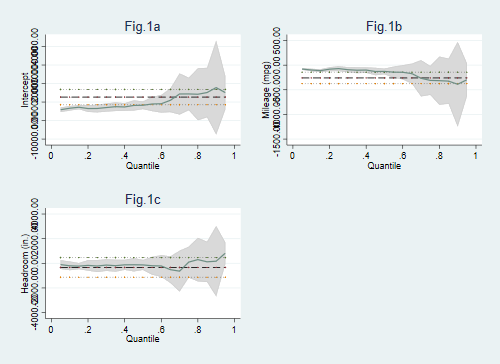
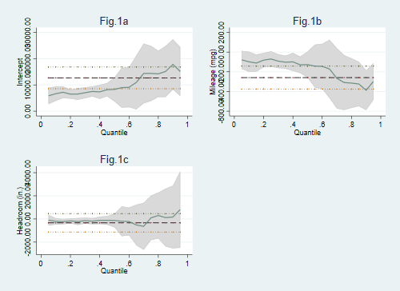
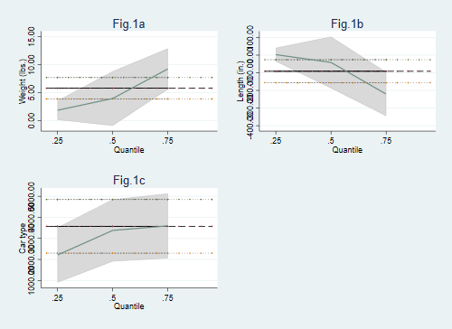
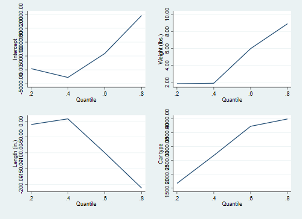
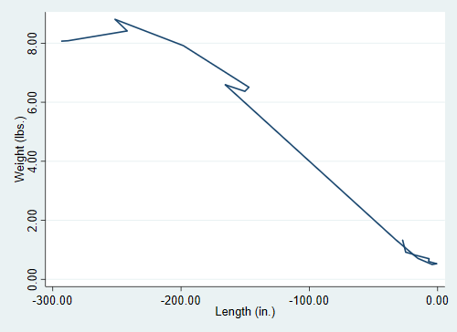
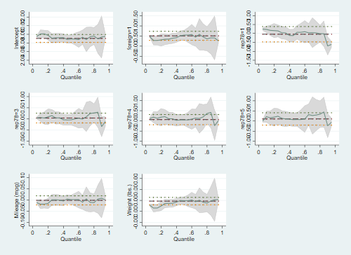
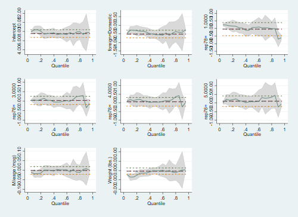

        ### Version Control
	
<pre id="stlog-1" class="stlog"><samp>. which grqreg
c:\ado\plus\g\grqreg.ado
*! version 2.1  (17 March 2011) Joao Pedro Azevedo
*! version 2.0  (10 March 2010) Joao Pedro Azevedo
</samp></pre>
        ### Example 1

<pre id="stlog-2" class="stlog"><samp>. version 9

. sysuse auto, clear
(1978 Automobile Data)

. xi: qreg price mpg i.foreign*i.rep78 headroom
i.foreign         _Iforeign_0-1       (naturally coded; _Iforeign_0 omitted)
i.rep78           _Irep78_1-5         (naturally coded; _Irep78_1 omitted)
i.for~n*i.rep78   _IforXrep_#_#       (coded as above)
note: _IforXrep_1_2 omitted because of collinearity
note: _IforXrep_1_3 omitted because of collinearity
Iteration  1:  WLS sum of weighted deviations =  58063.525

Iteration  1: sum of abs. weighted deviations =    66373.4
Iteration  2: sum of abs. weighted deviations =  55196.982
Iteration  3: sum of abs. weighted deviations =  54817.673
note:  alternate solutions exist
Iteration  4: sum of abs. weighted deviations =   54646.49
Iteration  5: sum of abs. weighted deviations =  54532.431
Iteration  6: sum of abs. weighted deviations =  54036.559
Iteration  7: sum of abs. weighted deviations =  53840.412
Iteration  8: sum of abs. weighted deviations =   53809.48

Median regression                                   Number of obs =         69
  Raw sum of deviations    65163 (about 5079)
  Min sum of deviations 53809.48                    Pseudo R2     =     0.1742

-------------------------------------------------------------------------------
        price |      Coef.   Std. Err.      t    P&gt;|t|     [95% Conf. Interval]
--------------+----------------------------------------------------------------
          mpg |    -207.56   50.92467    -4.08   0.000      -309.46     -105.66
  _Iforeign_1 |     100.56   1063.373     0.09   0.925    -2027.245    2228.365
    _Irep78_2 |     328.92   1309.485     0.25   0.803    -2291.353    2949.193
    _Irep78_3 |     163.76   1157.782     0.14   0.888    -2152.956    2480.476
    _Irep78_4 |      181.6   1285.305     0.14   0.888    -2390.289    2753.489
    _Irep78_5 |    1034.36   1487.782     0.70   0.490    -1942.684    4011.404
_IforXrep_1_4 |    1469.68   1379.996     1.06   0.291    -1291.686    4231.046
_IforXrep_1_5 |     825.84   1641.009     0.50   0.617    -2457.811    4109.491
     headroom |     -149.2   314.8362    -0.47   0.637    -779.1859    480.7859
        _cons |    9474.84     1724.3     5.49   0.000     6024.524    12925.16
-------------------------------------------------------------------------------

. grqreg, cons ci ols olsci
</samp></pre>
<figure id="fig-2">

</figure>
        ### Example 2

<pre id="stlog-3" class="stlog"><samp>. version 9

. qreg price mpg headroom
Iteration  1:  WLS sum of weighted deviations =  70255.799

Iteration  1: sum of abs. weighted deviations =  70990.429
Iteration  2: sum of abs. weighted deviations =  67518.917
note:  alternate solutions exist
Iteration  3: sum of abs. weighted deviations =      64777
Iteration  4: sum of abs. weighted deviations =  64587.083
Iteration  5: sum of abs. weighted deviations =  64574.074
Iteration  6: sum of abs. weighted deviations =  64552.093
Iteration  7: sum of abs. weighted deviations =  64549.833

Median regression                                   Number of obs =         74
  Raw sum of deviations  71102.5 (about 4934)
  Min sum of deviations 64549.83                    Pseudo R2     =     0.0922

------------------------------------------------------------------------------
       price |      Coef.   Std. Err.      t    P&gt;|t|     [95% Conf. Interval]
-------------+----------------------------------------------------------------
         mpg |  -127.3333   29.78595    -4.27   0.000    -186.7248   -67.94183
    headroom |  -130.6667   205.5906    -0.64   0.527    -540.6027    279.2694
       _cons |   8272.333   1051.025     7.87   0.000     6176.649    10368.02
------------------------------------------------------------------------------

. grqreg, cons ci ols olsci title(Fig.1a Fig.1b Fig.1c)
</samp></pre>
<figure id="fig-3">

</figure>
        ### Example 3

<pre id="stlog-4" class="stlog"><samp>. version 9

. bsqreg price mpg headroom, reps(100)
(fitting base model)

Bootstrap replications (100)
----+--- 1 ---+--- 2 ---+--- 3 ---+--- 4 ---+--- 5 
..................................................    50
..................................................   100

Median regression, bootstrap(100) SEs               Number of obs =         74
  Raw sum of deviations  71102.5 (about 4934)
  Min sum of deviations 64549.83                    Pseudo R2     =     0.0922

------------------------------------------------------------------------------
       price |      Coef.   Std. Err.      t    P&gt;|t|     [95% Conf. Interval]
-------------+----------------------------------------------------------------
         mpg |  -127.3333   64.37143    -1.98   0.052    -255.6863    1.019661
    headroom |  -130.6667   268.1515    -0.49   0.628    -665.3457    404.0123
       _cons |   8272.333   2165.832     3.82   0.000     3953.787    12590.88
------------------------------------------------------------------------------

. grqreg, cons ci ols olsci title(Fig.1a Fig.1b Fig.1c)

std error of grqreg will not be the same as one reported after estimation. Please use the 
&gt; seed option of grqreg.
</samp></pre>
<figure id="fig-4">

</figure>
        ### Example 4

<pre id="stlog-5" class="stlog"><samp>. version 9

. sqreg price weight length foreign, quantile(.25 .5 .75) reps(100)
(fitting base model)

Bootstrap replications (100)
----+--- 1 ---+--- 2 ---+--- 3 ---+--- 4 ---+--- 5 
..................................................    50
..................................................   100

Simultaneous quantile regression                    Number of obs =         74
  bootstrap(100) SEs                                .25 Pseudo R2 =     0.1697
                                                    .50 Pseudo R2 =     0.2347
                                                    .75 Pseudo R2 =     0.3840

------------------------------------------------------------------------------
             |              Bootstrap
       price |      Coef.   Std. Err.      t    P&gt;|t|     [95% Conf. Interval]
-------------+----------------------------------------------------------------
q25          |
      weight |   1.831789   1.368944     1.34   0.185    -.8984846    4.562062
      length |    2.84556   28.84499     0.10   0.922    -54.68396    60.37508
     foreign |   2209.925   992.3935     2.23   0.029     230.6589    4189.192
       _cons |  -1879.775   2804.829    -0.67   0.505     -7473.83    3714.281
-------------+----------------------------------------------------------------
q50          |
      weight |   3.933588   2.718706     1.45   0.152      -1.4887    9.355876
      length |  -41.25191   69.46919    -0.59   0.555    -179.8038    97.30003
     foreign |   3377.771   1155.879     2.92   0.005     1072.443    5683.099
       _cons |   344.6489   5758.657     0.06   0.952    -11140.63    11829.93
-------------+----------------------------------------------------------------
q75          |
      weight |    9.22291   2.363416     3.90   0.000     4.509226    13.93659
      length |  -220.7833   80.89277    -2.73   0.008    -382.1188   -59.44774
     foreign |   3595.133   1181.479     3.04   0.003     1238.747    5951.519
       _cons |    20242.9   8957.372     2.26   0.027     2377.989    38107.82
------------------------------------------------------------------------------

. grqreg, ci ols olsci title(Fig.1a Fig.1b Fig.1c)

std error of grqreg will not be the same as one reported after estimation. Please use the 
&gt; seed option of grqreg.
Only coefficients .25.5.75 will be plotted.
</samp></pre>
<figure id="fig-5">

</figure>
        ### Example 5

<pre id="stlog-6" class="stlog"><samp>. version 9

. sqreg price weight length foreign, quantile(.2 .4 .6 .8) reps(100)
(fitting base model)

Bootstrap replications (100)
----+--- 1 ---+--- 2 ---+--- 3 ---+--- 4 ---+--- 5 
..................................................    50
..................................................   100

Simultaneous quantile regression                    Number of obs =         74
  bootstrap(100) SEs                                .20 Pseudo R2 =     0.1507
                                                    .40 Pseudo R2 =     0.2089
                                                    .60 Pseudo R2 =     0.2692
                                                    .80 Pseudo R2 =     0.4425

------------------------------------------------------------------------------
             |              Bootstrap
       price |      Coef.   Std. Err.      t    P&gt;|t|     [95% Conf. Interval]
-------------+----------------------------------------------------------------
q20          |
      weight |   1.843421   .9457788     1.95   0.055    -.0428753    3.729717
      length |  -10.79474   24.02963    -0.45   0.655    -58.72033    37.13086
     foreign |   1666.437   956.5004     1.74   0.086    -241.2431    3574.117
       _cons |   441.0289   3212.624     0.14   0.891    -5966.348    6848.406
-------------+----------------------------------------------------------------
q40          |
      weight |   1.893098   1.889868     1.00   0.320    -1.876124     5.66232
      length |   7.228114   44.11411     0.16   0.870    -80.75471    95.21094
     foreign |   2676.242   1052.317     2.54   0.013     577.4613    4775.022
       _cons |  -2753.278   3550.368    -0.78   0.441    -9834.263    4327.707
-------------+----------------------------------------------------------------
q60          |
      weight |   5.975028    2.92722     2.04   0.045     .1368718    11.81319
      length |  -100.1002   81.66473    -1.23   0.224    -262.9754    62.77498
     foreign |   3730.962   1017.109     3.67   0.000     1702.403    5759.522
       _cons |   5901.206   7395.089     0.80   0.428    -8847.834    20650.25
-------------+----------------------------------------------------------------
q80          |
      weight |   8.906373   2.030826     4.39   0.000     4.856018    12.95673
      length |  -211.7601   72.78394    -2.91   0.005    -356.9231   -66.59709
     foreign |   3995.263   1076.082     3.71   0.000     1849.085    6141.442
       _cons |   19619.38   8057.916     2.43   0.017     3548.375    35690.39
------------------------------------------------------------------------------

. grqreg, cons

std error of grqreg will not be the same as one reported after estimation. Please use the 
&gt; seed option of grqreg.
Only coefficients .2.4.6.8 will be plotted.
</samp></pre>
<figure id="fig-6">

</figure>
        ### Example 6

<pre id="stlog-7" class="stlog"><samp>. version 9

. qreg price mpg trunk weight length
Iteration  1:  WLS sum of weighted deviations =  68803.454

Iteration  1: sum of abs. weighted deviations =  69805.998
Iteration  2: sum of abs. weighted deviations =   68423.82
Iteration  3: sum of abs. weighted deviations =  65030.549
Iteration  4: sum of abs. weighted deviations =  64071.249
Iteration  5: sum of abs. weighted deviations =  63759.964
Iteration  6: sum of abs. weighted deviations =  63684.357
Iteration  7: sum of abs. weighted deviations =  63683.491
Iteration  8: sum of abs. weighted deviations =  63634.704
Iteration  9: sum of abs. weighted deviations =  63630.885

Median regression                                   Number of obs =         74
  Raw sum of deviations  71102.5 (about 4934)
  Min sum of deviations 63630.88                    Pseudo R2     =     0.1051

------------------------------------------------------------------------------
       price |      Coef.   Std. Err.      t    P&gt;|t|     [95% Conf. Interval]
-------------+----------------------------------------------------------------
         mpg |  -55.43658   69.82922    -0.79   0.430    -194.7421     83.8689
       trunk |   72.83793   76.36949     0.95   0.344    -79.51503    225.1909
      weight |   .7098819   1.013434     0.70   0.486    -1.311863    2.731626
      length |  -15.38537   36.16137    -0.43   0.672    -87.52533    56.75459
       _cons |   6005.006   4987.934     1.20   0.233    -3945.651    15955.66
------------------------------------------------------------------------------

. grqreg weight length, compare
</samp></pre>
<figure id="fig-7">

</figure>
        ### Example 7a

<pre id="stlog-8" class="stlog"><samp>. version 16

. 
. sysuse auto, clear
(1978 Automobile Data)

. 
. gen ln_price = ln(price)

. 
. char rep78[omit] 2

. 
. global ylist ln_price

. 
. global xlist i.foreign  mpg weight i.rep78 

. 
. *global xlist i.sexo edad ib(2).edo_conyug i.DOCniv_ed i.region hli i.tot_integ ib(9).po
&gt; sicion i.sector
. 
. xi: reg $ylist $xlist , vce(robust) baselevels
i.foreign         _Iforeign_0-1       (naturally coded; _Iforeign_0 omitted)
i.rep78           _Irep78_1-5         (naturally coded; _Irep78_2 omitted)

Linear regression                               Number of obs     =         69
                                                F(7, 61)          =      10.64
                                                Prob &gt; F          =     0.0000
                                                R-squared         =     0.5603
                                                Root MSE          =     .27164

------------------------------------------------------------------------------
             |               Robust
    ln_price |      Coef.   Std. Err.      t    P&gt;|t|     [95% Conf. Interval]
-------------+----------------------------------------------------------------
 _Iforeign_1 |   .5108752   .1298752     3.93   0.000     .2511736    .7705767
         mpg |  -.0014682   .0101162    -0.15   0.885    -.0216967    .0187604
      weight |    .000469   .0000984     4.77   0.000     .0002723    .0006657
   _Irep78_1 |  -.0434365   .1357329    -0.32   0.750    -.3148512    .2279781
   _Irep78_3 |   .0424603   .1286047     0.33   0.742    -.2147007    .2996214
   _Irep78_4 |    .062527   .1423333     0.44   0.662    -.2220861    .3471401
   _Irep78_5 |   .1034642   .1627644     0.64   0.527    -.2220033    .4289316
       _cons |   7.043255   .5081997    13.86   0.000     6.027047    8.059463
------------------------------------------------------------------------------

. 
. global xlist2 _Iforeign_1 _Irep78_1 _Irep78_3 _Irep78_4 _Irep78_5 mpg weight

. 
. 
. qreg $ylist $xlist2 , quantile(.1121) vce(robust) baselevels
Iteration  1:  WLS sum of weighted deviations =  5.4474386

Iteration  1: sum of abs. weighted deviations =  25.036073
Iteration  2: sum of abs. weighted deviations =  5.8899536
Iteration  3: sum of abs. weighted deviations =   5.339525
Iteration  4: sum of abs. weighted deviations =  4.5276173
Iteration  5: sum of abs. weighted deviations =  4.1166431
Iteration  6: sum of abs. weighted deviations =   3.624363
Iteration  7: sum of abs. weighted deviations =  3.4509685
Iteration  8: sum of abs. weighted deviations =  2.9401871
Iteration  9: sum of abs. weighted deviations =  2.7041443
Iteration 10: sum of abs. weighted deviations =  2.6892893
Iteration 11: sum of abs. weighted deviations =  2.6247496
Iteration 12: sum of abs. weighted deviations =  2.5989691
Iteration 13: sum of abs. weighted deviations =  2.5884836
Iteration 14: sum of abs. weighted deviations =  2.5088703
Iteration 15: sum of abs. weighted deviations =  2.5088664

.1121 Quantile regression                           Number of obs =         69
  Raw sum of deviations 3.352709 (about 8.2674494)
  Min sum of deviations 2.508866                    Pseudo R2     =     0.2517

------------------------------------------------------------------------------
             |               Robust
    ln_price |      Coef.   Std. Err.      t    P&gt;|t|     [95% Conf. Interval]
-------------+----------------------------------------------------------------
 _Iforeign_1 |   .2824672   .0837367     3.37   0.001     .1150254     .449909
   _Irep78_1 |    .227352   .0616118     3.69   0.000     .1041516    .3505523
   _Irep78_3 |   .0679125   .0708919     0.96   0.342    -.0738446    .2096695
   _Irep78_4 |   .1845588   .0802062     2.30   0.025     .0241766     .344941
   _Irep78_5 |   .2155663   .1189561     1.81   0.075    -.0223011    .4534338
         mpg |  -.0184686   .0075579    -2.44   0.017    -.0335814   -.0033557
      weight |   .0001538   .0000597     2.58   0.012     .0000344    .0002732
       _cons |   8.075313   .3316648    24.35   0.000     7.412108    8.738517
------------------------------------------------------------------------------

. qreg $ylist $xlist2 , quantile(.2562) vce(robust) baselevels
Iteration  1:  WLS sum of weighted deviations =  6.1698334

Iteration  1: sum of abs. weighted deviations =  6.2066856
Iteration  2: sum of abs. weighted deviations =    6.12047
Iteration  3: sum of abs. weighted deviations =     5.4994
Iteration  4: sum of abs. weighted deviations =  5.2645703
Iteration  5: sum of abs. weighted deviations =  5.2026678
Iteration  6: sum of abs. weighted deviations =   4.999929
Iteration  7: sum of abs. weighted deviations =  4.8076576
Iteration  8: sum of abs. weighted deviations =  4.8069298
Iteration  9: sum of abs. weighted deviations =  4.8068465

.2562 Quantile regression                           Number of obs =         69
  Raw sum of deviations 6.558408 (about 8.3397398)
  Min sum of deviations 4.806846                    Pseudo R2     =     0.2671

------------------------------------------------------------------------------
             |               Robust
    ln_price |      Coef.   Std. Err.      t    P&gt;|t|     [95% Conf. Interval]
-------------+----------------------------------------------------------------
 _Iforeign_1 |    .341977   .1115977     3.06   0.003     .1188964    .5650576
   _Irep78_1 |   .0423206          .        .       .            .           .
   _Irep78_3 |    .048169   .1559409     0.31   0.758    -.2635523    .3598904
   _Irep78_4 |   .1061359   .1784922     0.59   0.554    -.2506649    .4629368
   _Irep78_5 |    .136232   .1739479     0.78   0.437    -.2114849     .483949
         mpg |   .0008275    .014491     0.06   0.955    -.0281396    .0297945
      weight |   .0003603   .0001152     3.13   0.003       .00013    .0005906
       _cons |    7.19643   .6357258    11.32   0.000     5.925633    8.467228
------------------------------------------------------------------------------

. qreg $ylist $xlist2 , quantile(.4011) vce(robust) baselevels
Iteration  1:  WLS sum of weighted deviations =  6.6151245

Iteration  1: sum of abs. weighted deviations =  6.7863172
Iteration  2: sum of abs. weighted deviations =  6.7337049
Iteration  3: sum of abs. weighted deviations =  6.3983182
Iteration  4: sum of abs. weighted deviations =  6.2515804
Iteration  5: sum of abs. weighted deviations =  6.2210777
Iteration  6: sum of abs. weighted deviations =   6.174156
Iteration  7: sum of abs. weighted deviations =  6.1738324
Iteration  8: sum of abs. weighted deviations =  6.1685357
Iteration  9: sum of abs. weighted deviations =  6.1683545

.4011 Quantile regression                           Number of obs =         69
  Raw sum of deviations 8.862282 (about 8.4546795)
  Min sum of deviations 6.168354                    Pseudo R2     =     0.3040

------------------------------------------------------------------------------
             |               Robust
    ln_price |      Coef.   Std. Err.      t    P&gt;|t|     [95% Conf. Interval]
-------------+----------------------------------------------------------------
 _Iforeign_1 |   .4930117   .1582999     3.11   0.003     .1764716    .8095519
   _Irep78_1 |  -.1122191   .1377734    -0.81   0.419    -.3877141     .163276
   _Irep78_3 |  -.0371448   .1094091    -0.34   0.735    -.2559219    .1816323
   _Irep78_4 |   .0290209    .153416     0.19   0.851    -.2777534    .3357952
   _Irep78_5 |   .0215818   .2069006     0.10   0.917    -.3921416    .4353052
         mpg |  -.0046212   .0123565    -0.37   0.710    -.0293296    .0200873
      weight |   .0004228   .0000985     4.29   0.000     .0002258    .0006198
       _cons |   7.232151   .5469786    13.22   0.000       6.1384    8.325902
------------------------------------------------------------------------------

. qreg $ylist $xlist2 , quantile(.5232) vce(robust) baselevels
Iteration  1:  WLS sum of weighted deviations =  6.7958447

Iteration  1: sum of abs. weighted deviations =  6.8588166
Iteration  2: sum of abs. weighted deviations =  6.7872914
Iteration  3: sum of abs. weighted deviations =  6.6648395

.5232 Quantile regression                           Number of obs =         69
  Raw sum of deviations 10.11022 (about 8.5377798)
  Min sum of deviations  6.66484                    Pseudo R2     =     0.3408

------------------------------------------------------------------------------
             |               Robust
    ln_price |      Coef.   Std. Err.      t    P&gt;|t|     [95% Conf. Interval]
-------------+----------------------------------------------------------------
 _Iforeign_1 |   .5487176   .0932672     5.88   0.000     .3622185    .7352168
   _Irep78_1 |   .0645521   .1333406     0.48   0.630    -.2020789    .3311831
   _Irep78_3 |  -.0155096   .1133294    -0.14   0.892    -.2421257    .2111065
   _Irep78_4 |   .0489684   .1192354     0.41   0.683    -.1894575    .2873943
   _Irep78_5 |   .0751907   .1523226     0.49   0.623    -.2293972    .3797786
         mpg |   .0015589   .0116453     0.13   0.894    -.0217272    .0248451
      weight |   .0004839   .0000915     5.29   0.000      .000301    .0006669
       _cons |   6.918565   .5021886    13.78   0.000     5.914376    7.922753
------------------------------------------------------------------------------

. qreg $ylist $xlist2 , quantile(.6106) vce(robust) baselevels
Iteration  1:  WLS sum of weighted deviations =  6.8154121

Iteration  1: sum of abs. weighted deviations =  6.7905909
Iteration  2: sum of abs. weighted deviations =   6.786993

.6106 Quantile regression                           Number of obs =         69
  Raw sum of deviations 10.43622 (about 8.6490984)
  Min sum of deviations 6.786993                    Pseudo R2     =     0.3497

------------------------------------------------------------------------------
             |               Robust
    ln_price |      Coef.   Std. Err.      t    P&gt;|t|     [95% Conf. Interval]
-------------+----------------------------------------------------------------
 _Iforeign_1 |   .5881271   .1810923     3.25   0.002     .2260107    .9502435
   _Irep78_1 |   .0713214    .130316     0.55   0.586    -.1892616    .3319044
   _Irep78_3 |   .0627545   .0835455     0.75   0.455    -.1043051    .2298142
   _Irep78_4 |   .0570218   .1340484     0.43   0.672    -.2110245    .3250682
   _Irep78_5 |   .0460545   .1890994     0.24   0.808    -.3320732    .4241822
         mpg |   .0016507   .0162437     0.10   0.919    -.0308306    .0341319
      weight |   .0004913   .0001362     3.61   0.001     .0002189    .0007636
       _cons |   6.889561   .7409569     9.30   0.000     5.407926    8.371196
------------------------------------------------------------------------------

.  
. quietly qreg $ylist $xlist2

. 
. grqreg, cons ci ols olsci
</samp></pre>
<figure id="fig-8">

</figure>
        ### Example 7b

<pre id="stlog-9" class="stlog"><samp>. tab foreign, gen(foreign) 

   Car type |      Freq.     Percent        Cum.
------------+-----------------------------------
   Domestic |         52       70.27       70.27
    Foreign |         22       29.73      100.00
------------+-----------------------------------
      Total |         74      100.00

. tab rep78, gen(rep78_)

     Repair |
Record 1978 |      Freq.     Percent        Cum.
------------+-----------------------------------
          1 |          2        2.90        2.90
          2 |          8       11.59       14.49
          3 |         30       43.48       57.97
          4 |         18       26.09       84.06
          5 |         11       15.94      100.00
------------+-----------------------------------
      Total |         69      100.00

. 
. global xlist3 foreign1 rep78_1 rep78_3 rep78_4 rep78_5 mpg weight

. 
. qreg $ylist $xlist3 , quantile(.1121) vce(robust) baselevels
Iteration  1:  WLS sum of weighted deviations =  5.4474386

Iteration  1: sum of abs. weighted deviations =  25.036073
Iteration  2: sum of abs. weighted deviations =  5.8899536
Iteration  3: sum of abs. weighted deviations =   5.339525
Iteration  4: sum of abs. weighted deviations =  4.5276173
Iteration  5: sum of abs. weighted deviations =  4.1166431
Iteration  6: sum of abs. weighted deviations =   3.624363
Iteration  7: sum of abs. weighted deviations =  3.4509685
Iteration  8: sum of abs. weighted deviations =  2.9401871
Iteration  9: sum of abs. weighted deviations =  2.7041443
Iteration 10: sum of abs. weighted deviations =  2.6892893
Iteration 11: sum of abs. weighted deviations =  2.6247496
Iteration 12: sum of abs. weighted deviations =  2.5989691
Iteration 13: sum of abs. weighted deviations =  2.5884836
Iteration 14: sum of abs. weighted deviations =  2.5088703
Iteration 15: sum of abs. weighted deviations =  2.5088664

.1121 Quantile regression                           Number of obs =         69
  Raw sum of deviations 3.352709 (about 8.2674494)
  Min sum of deviations 2.508866                    Pseudo R2     =     0.2517

------------------------------------------------------------------------------
             |               Robust
    ln_price |      Coef.   Std. Err.      t    P&gt;|t|     [95% Conf. Interval]
-------------+----------------------------------------------------------------
    foreign1 |  -.2824672   .0837367    -3.37   0.001     -.449909   -.1150254
     rep78_1 |    .227352   .0616118     3.69   0.000     .1041516    .3505523
     rep78_3 |   .0679125   .0708919     0.96   0.342    -.0738446    .2096695
     rep78_4 |   .1845588   .0802062     2.30   0.025     .0241766     .344941
     rep78_5 |   .2155663   .1189561     1.81   0.075    -.0223011    .4534338
         mpg |  -.0184686   .0075579    -2.44   0.017    -.0335814   -.0033557
      weight |   .0001538   .0000597     2.58   0.012     .0000344    .0002732
       _cons |    8.35778   .2908464    28.74   0.000     7.776196    8.939363
------------------------------------------------------------------------------

. qreg $ylist $xlist3 , quantile(.2562) vce(robust) baselevels
Iteration  1:  WLS sum of weighted deviations =  6.1698334

Iteration  1: sum of abs. weighted deviations =  6.2066856
Iteration  2: sum of abs. weighted deviations =    6.12047
Iteration  3: sum of abs. weighted deviations =     5.4994
Iteration  4: sum of abs. weighted deviations =  5.2645703
Iteration  5: sum of abs. weighted deviations =  5.2026678
Iteration  6: sum of abs. weighted deviations =   4.999929
Iteration  7: sum of abs. weighted deviations =  4.8076576
Iteration  8: sum of abs. weighted deviations =  4.8069298
Iteration  9: sum of abs. weighted deviations =  4.8068465

.2562 Quantile regression                           Number of obs =         69
  Raw sum of deviations 6.558408 (about 8.3397398)
  Min sum of deviations 4.806846                    Pseudo R2     =     0.2671

------------------------------------------------------------------------------
             |               Robust
    ln_price |      Coef.   Std. Err.      t    P&gt;|t|     [95% Conf. Interval]
-------------+----------------------------------------------------------------
    foreign1 |   -.341977   .1115977    -3.06   0.003    -.5650576   -.1188964
     rep78_1 |   .0423206          .        .       .            .           .
     rep78_3 |    .048169   .1559409     0.31   0.758    -.2635523    .3598904
     rep78_4 |   .1061359   .1784922     0.59   0.554    -.2506649    .4629368
     rep78_5 |    .136232   .1739479     0.78   0.437    -.2114849     .483949
         mpg |   .0008275    .014491     0.06   0.955    -.0281396    .0297945
      weight |   .0003603   .0001152     3.13   0.003       .00013    .0005906
       _cons |   7.538407   .5826462    12.94   0.000     6.373714    8.703101
------------------------------------------------------------------------------

. qreg $ylist $xlist3 , quantile(.4011) vce(robust) baselevels
Iteration  1:  WLS sum of weighted deviations =  6.6151245

Iteration  1: sum of abs. weighted deviations =  6.7863172
Iteration  2: sum of abs. weighted deviations =  6.7337049
Iteration  3: sum of abs. weighted deviations =  6.3983182
Iteration  4: sum of abs. weighted deviations =  6.2515804
Iteration  5: sum of abs. weighted deviations =  6.2210777
Iteration  6: sum of abs. weighted deviations =   6.174156
Iteration  7: sum of abs. weighted deviations =  6.1738324
Iteration  8: sum of abs. weighted deviations =  6.1685357
Iteration  9: sum of abs. weighted deviations =  6.1683545

.4011 Quantile regression                           Number of obs =         69
  Raw sum of deviations 8.862282 (about 8.4546795)
  Min sum of deviations 6.168354                    Pseudo R2     =     0.3040

------------------------------------------------------------------------------
             |               Robust
    ln_price |      Coef.   Std. Err.      t    P&gt;|t|     [95% Conf. Interval]
-------------+----------------------------------------------------------------
    foreign1 |  -.4930117   .1582999    -3.11   0.003    -.8095519   -.1764716
     rep78_1 |  -.1122191   .1377734    -0.81   0.419    -.3877141     .163276
     rep78_3 |  -.0371448   .1094091    -0.34   0.735    -.2559219    .1816323
     rep78_4 |   .0290209    .153416     0.19   0.851    -.2777534    .3357952
     rep78_5 |   .0215818   .2069006     0.10   0.917    -.3921416    .4353052
         mpg |  -.0046212   .0123565    -0.37   0.710    -.0293296    .0200873
      weight |   .0004228   .0000985     4.29   0.000     .0002258    .0006198
       _cons |   7.725163   .4997553    15.46   0.000      6.72584    8.724485
------------------------------------------------------------------------------

. qreg $ylist $xlist3 , quantile(.5232) vce(robust) baselevels
Iteration  1:  WLS sum of weighted deviations =  6.7958447

Iteration  1: sum of abs. weighted deviations =  6.8588166
Iteration  2: sum of abs. weighted deviations =  6.7872914
Iteration  3: sum of abs. weighted deviations =  6.6648395

.5232 Quantile regression                           Number of obs =         69
  Raw sum of deviations 10.11022 (about 8.5377798)
  Min sum of deviations  6.66484                    Pseudo R2     =     0.3408

------------------------------------------------------------------------------
             |               Robust
    ln_price |      Coef.   Std. Err.      t    P&gt;|t|     [95% Conf. Interval]
-------------+----------------------------------------------------------------
    foreign1 |  -.5487176   .0932672    -5.88   0.000    -.7352168   -.3622185
     rep78_1 |   .0645521   .1333406     0.48   0.630    -.2020789    .3311831
     rep78_3 |  -.0155096   .1133294    -0.14   0.892    -.2421257    .2111065
     rep78_4 |   .0489684   .1192354     0.41   0.683    -.1894575    .2873943
     rep78_5 |   .0751907   .1523226     0.49   0.623    -.2293972    .3797786
         mpg |   .0015589   .0116453     0.13   0.894    -.0217272    .0248451
      weight |   .0004839   .0000915     5.29   0.000      .000301    .0006669
       _cons |   7.467282   .5005152    14.92   0.000      6.46644    8.468124
------------------------------------------------------------------------------

. qreg $ylist $xlist3 , quantile(.6106) vce(robust) baselevels
Iteration  1:  WLS sum of weighted deviations =  6.8154121

Iteration  1: sum of abs. weighted deviations =  6.7905909
Iteration  2: sum of abs. weighted deviations =   6.786993

.6106 Quantile regression                           Number of obs =         69
  Raw sum of deviations 10.43622 (about 8.6490984)
  Min sum of deviations 6.786993                    Pseudo R2     =     0.3497

------------------------------------------------------------------------------
             |               Robust
    ln_price |      Coef.   Std. Err.      t    P&gt;|t|     [95% Conf. Interval]
-------------+----------------------------------------------------------------
    foreign1 |  -.5881271   .1810923    -3.25   0.002    -.9502435   -.2260107
     rep78_1 |   .0713214    .130316     0.55   0.586    -.1892616    .3319044
     rep78_3 |   .0627545   .0835455     0.75   0.455    -.1043051    .2298142
     rep78_4 |   .0570218   .1340484     0.43   0.672    -.2110245    .3250682
     rep78_5 |   .0460545   .1890994     0.24   0.808    -.3320732    .4241822
         mpg |   .0016507   .0162437     0.10   0.919    -.0308306    .0341319
      weight |   .0004913   .0001362     3.61   0.001     .0002189    .0007636
       _cons |   7.477688   .6672161    11.21   0.000     6.143507    8.811869
------------------------------------------------------------------------------

.  
. quietly qreg $ylist $xlist3

. 
. grqreg, cons ci ols olsci
</samp></pre>
<figure id="fig-9">

</figure>
